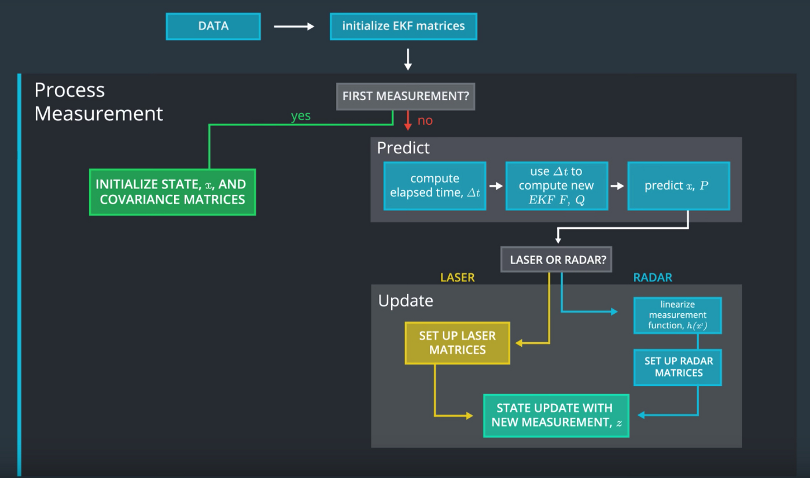
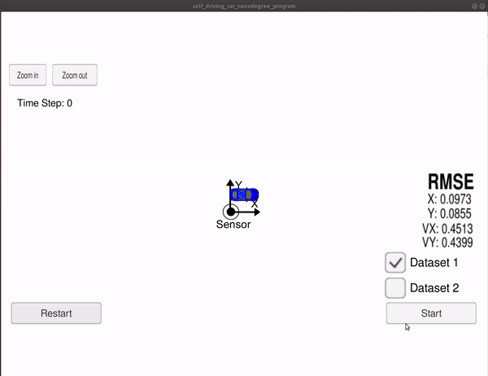

# Extended Kalman Filter Project using C++

In this project I utilized a kalman filter to estimate the state of a moving object of interest with noisy lidar and radar measurements. 

A great note could be found [here](https://medium.com/intro-to-artificial-intelligence/extended-kalman-filter-simplified-udacitys-self-driving-car-nanodegree-46d952fce7a3)
## High level architecture of Extended Kalman Filter



## Important Dependencies
* cmake >= 3.5
  * All OSes: [click here for installation instructions](https://cmake.org/install/)
* make >= 4.1 (Linux, Mac), 3.81 (Windows)
  * Linux: make is installed by default on most Linux distros
  * Mac: [install Xcode command line tools to get make](https://developer.apple.com/xcode/features/)
  * Windows: [Click here for installation instructions](http://gnuwin32.sourceforge.net/packages/make.htm)
* gcc/g++ >= 5.4
  * Linux: gcc / g++ is installed by default on most Linux distros
  * Mac: same deal as make - [install Xcode command line tools](https://developer.apple.com/xcode/features/)
  * Windows: recommend using [MinGW](http://www.mingw.org/)

## How to compile and run
1. Download the Term 2 Simulator [here](https://github.com/udacity/self-driving-car-sim/releases).
2. Install `uWebSocketIO`: <br>
This repository includes two files that can be used to set up and install [uWebSocketIO](https://github.com/uWebSockets/uWebSockets) 
for either Linux or Mac systems. For windows you can use either Docker, VMware, 
or even [Windows 10 Bash on Ubuntu](https://www.howtogeek.com/249966/how-to-install-and-use-the-linux-bash-shell-on-windows-10/)<br>
You can execute the `install-ubuntu.sh` to install uWebSocketIO.

3. Once the install for uWebSocketIO is complete, the main program can be built and run by doing the following from the project top directory.
    ```shell script
    mkdir build
    cd build
    cmake ..
    make
    ./ExtendedKF
    ```

## Results
The simulation is tracking the blue car, the initial position of the car, the RADAR and LIDAR sensors are ar the origin of the coordinates system.
- Red circles are lidar measurements.
- Blue circles are radar measurements (an arrow pointing in the direction of the observed angle).
- Green markers are the car's position as estimated by the Kalman filter. <br>



Obviously, the Kalman filter works well on tracking the car's position with significantly reduced noise.
The Root Mean Square Error:
- X: 0.0973
- Y: 0.0855
- Vx: 0.4513
- Vy: 0.4399

## Generating Additional Data
See the [utilities repo](https://github.com/udacity/CarND-Mercedes-SF-Utilities) for Matlab scripts that can generate additional data.
